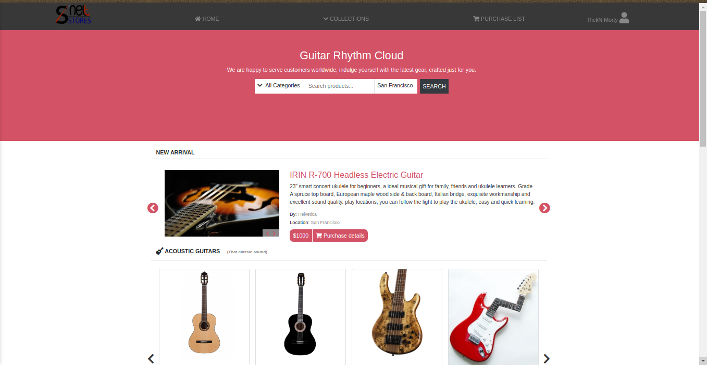

# HTML & CSS Capstone

This project marks the basic concept understanding of the HTML and CSS. It's a design of an online Guitar Instrument shop. 

Inspiration for the design is entirely from the developer/author basing on the layout, font family and colors given in the description. 

## Built With

- HTML
- CSS
- Bootstrap
- Sass

## Live Demo

[Live Demo Link](https://rawcdn.githack.com/Janluc/Newsweek-Clone/9197394ca6086876e896c8302ca800909b86da6c/index.html)

## Getting Started

To get a local copy up and running follow these simple example steps.

### Prerequisites

- A operating system such as Windows, MAC, or Linux
- A modern browser such as Google Chrome, Mozilla Firefox, or Microsoft Edge

### Setup
- Clone or download the repo and run the HTML File.

## Authors

👤 **Author**

- GitHub: [@mke2111](https://github.com/mke2111)
- Twitter: [@Roymkenya](https://twitter.com/Roymkenya)
- LinkedIn: [Roy Mukuye](https://www.linkedin.com/in/roy-mukuye-42b07b1b4)

## 🤝 Contributing

Contributions, issues, and feature requests are welcome!

Feel free to check the [issues page](https://github.com/mke2111/HTML-CSS-pjt/issues).

## Show your support

Give a ⭐️ if you like this project!
